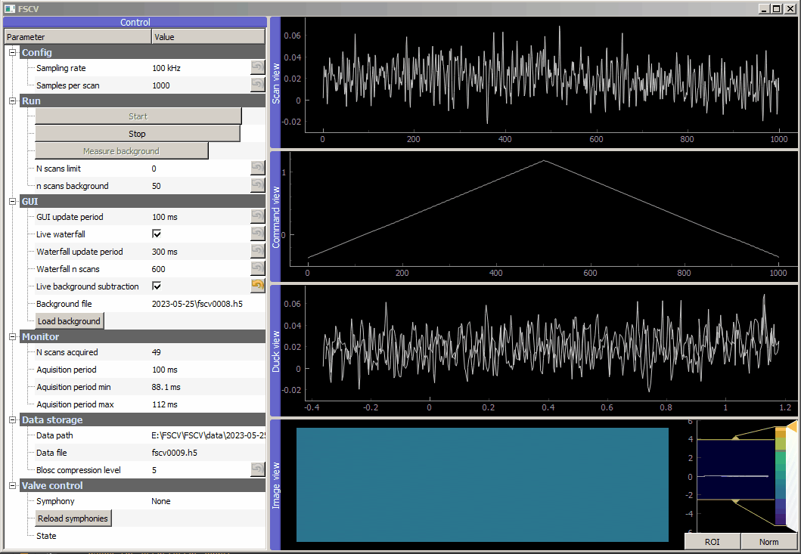

# FSCV



A GUI to perform Fast Scanning Cyclic Voltammetry (FSCV). It uses Ni Hardware for data acquisition (Ni-PXIe 1062Q) and a NPI VA-10x amplifier.

## Requirements
General requirements:
 - pyqtgraph
 - pytables
 - nidaqmx

Lab-Computer: 
 - python=3.7.11
 - pyqtgraph=0.12.3
 - pytables=3.6.1
 - nidaqmx-python=0.5.7

(see also environment.yml, but note that this contains quite an overhead, like pypylon for Basler cameras etc.)

## Config

To set the data folder use a config.ini file, e.g.:

```dosini
[DEFAULT]
datapath = C:\data
```

## Valve pattern syntax (symphonies)
example
```dosini
[DEFAULT]
# Default chords are applied in every symphony
0 = 0000 0000
# The final chord is always applied when a measurement is stopped
final_chord = 0000 0000

[Test 1]
1= 0000 0000
2= 1111 0000
3= 0000 1111
4= 1111 1111

[Test 2]
5  = 1000 0000
10 = 0100 0000
```


